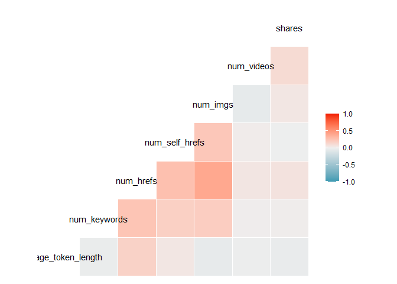
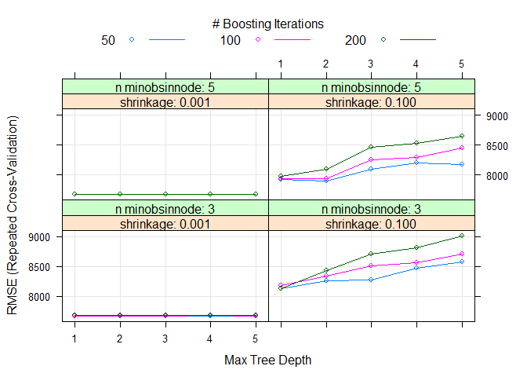
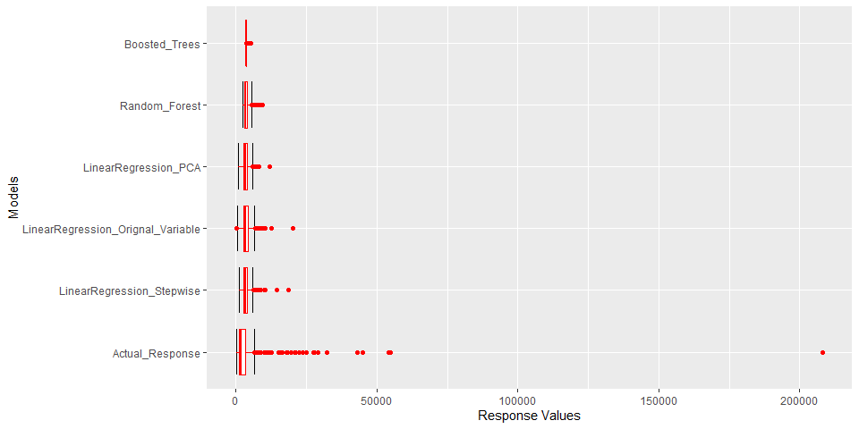

Project 3: Predictive Model for `data_channel_is_lifestyle` Analysis
================
Smitali Paknaik and Paula Bailey
2022-11-16

<style type="text/css">

h1.title {
  font-size: 38px;
  text-align: center;
}
h4.author {
    font-size: 25px;
  font-family: "Times New Roman", Times, serif;
  text-align: center;
}
h4.date { 
  font-size: 25px;
  font-family: "Times New Roman", Times, serif;
  text-align: center;
}
</style>

# Introduction

Social and Online media is now perfused into our society and by getting
to know how people think and what they like, we get valuable information
on how new/information spreads through out a small society or globally
and how it affects the members of a community, their thinking and their
actions. This information is very useful for product based companies
trying to sell products, advertising companies, writers, influencers
etc. Not only that, we also know that it also has lot of impact at
political and economic changes occurring within a state or country. What
is advertised well can make good best sales, going by that theory
companies have now started encashing machine learning methods to know
about consumer responses from historical data and use it for expanding
markets.

The main goal of this project is to analyze a similar
OnlineNewsPopularity data using Exploratory Data Analysis (EDA) and
apply regression and ensemble methods to predict the response variable
‘\~share’ using a set of predictor variables optimized through variable
selection methods. That is, we will try to find out what parameters
impact number of online shares of information and whether they can help
us predict the number of shares from these parameters.

This OnlineNewsPopularity data is divided into some genre or channel and
each individual channel has its characteristics that need to be looked
at separately. And some generalization of analysis is necessary as it
helps speed up the process and automate the entire analysis at a mouse
click.

Our first step is to shape the data to get the various
data_channel_groups together in such a format that each channel can be
looked into separately . This is needed in order to get proper filtering
of the required channels in the automation script. The EDA is performed
on each channel using graphs, tables and heatmaps.

The next step includes creating train and test data for train fit and
test prediction. Prior to model fitting, variable
selection/pre-processing of data (if needed) is done. Two linear
regression models are the first step of performing model fit and
predictions. The data may be easily explained by a set of linear
equations and may not require complex algorithms that can consume time,
cost and may require computation speed. Hence, regression models often
are a great start to run predictions.

The other method evaluated is two types of ensemble methods- that are
Random Forest and Boosted Tree method. Both are types of ensemble
methods that use tree based model to evaluate future values. These
methods do not have any specified methodology in model fit. They work on
the best statistic obtained while constructing the model fit.
Theoretically ensemble methods are said to have a good prediction, and
using this data it will be evaluated on what categories how these models
perform.

At the end for each channel analysis, all 4 models are compared and best
model that suits this category of channel is noted.

#### About Data and Data Preparation

There are 48 parameters in the dataset. The channel parameter is
actually a categorical variable which will be used for filtering data in
this project and form our analysis into different set of channel files.
The categories in this are :
‘lifestyle’,‘entertainment’,‘bus’,‘socmed’,‘tech’ and ‘world’.
Additional information about this data can be accessed
[here](https://archive.ics.uci.edu/ml/datasets/Online+News+Popularity).

The csv file is imported read using `read_csv()`. As we have automated
the analysis, we need each channel to be fed into the R code we have and
get the analysis and predictions as a different file. The channel
categories are in column (or wide) format so they have been converted
into long format using `pivot_longer`. The required category is then
easily filtered by passing the channel variables into the filter code.

Irrelevant columns are removed like URL and timedelta as they do not
have any significance in our predictions models.

The Exploratory analysis and Modelling was carried on the remaining set
of select variables.

## Package Imports

-   The following packages are required for creating predictive models.

1.  `caret` To run the Regression and ensemble methods with Train/Split
    and cross validation.
2.  `dplyr` A part of the `tidyverse` used for manipulating data.
3.  `GGally` To create ggcorr and ggpairs correlation plots .
4.  `glmnet` To access best subset selection.
5.  `ggplot2` A part of the `tidyverse` used for creating graphics.
6.  `gridextra` To plot with multiple grid objects.
7.  `gt` To test a low-dimensional nullhypothesis against
    high-dimensional alternative models.
8.  `knitr` To get nice table printing formats, mainly for the
    contingency tables.
9.  `leaps` To identify different best models of different sizes.
10. `markdown` To render several output formats.
11. `MASS` To access forward and backward selection algorithms
12. `randomforest` To access random forest algorithms
13. `tidyr` A part of the `tidyverse` used for data cleaning

# Load data and check for NAs

``` r
data <- read.csv("OnlineNewsPopularity.csv") %>% 
                              rename(
                                    Monday      = `weekday_is_monday`,
                                    Tuesday     = `weekday_is_tuesday`,
                                    Wednesday   = `weekday_is_wednesday`,
                                    Thursday    = `weekday_is_thursday`,
                                    Friday      = `weekday_is_friday`,
                                    Saturday    = `weekday_is_saturday`,
                                    Sunday      = `weekday_is_sunday`) %>% 
                                    dplyr::select(-url, -timedelta)

#check for missing values
anyNA(data)  
```

    ## [1] FALSE

The UCI site mentioned that `url` and `timedelta` are non-predictive
variables, so we will remove them from our data set during the importing
process. Afterwards, we checked to validate the data set contained no
missing values. anyNA(data) returned FALSE, so the file has no missing
data.

For the automation process, it will be easier if all the channels (ie
data_channel_is\_\*) are in one column. We used `pivot_longer()` to
pivot columns: data_channel_is_lifestyle, data_channel_is_entertainment,
data_channel_is_bus, data_channel_is_socmed, data_channel_is_tech, and
data_channel_is_world from wide to long format.

``` r
dataPivot <- data %>% pivot_longer(cols = c("data_channel_is_lifestyle", "data_channel_is_entertainment", "data_channel_is_bus","data_channel_is_socmed","data_channel_is_tech", "data_channel_is_world"),names_to = "channel",values_to = "Temp") 


newData <- dataPivot %>% filter(Temp != 0) %>% dplyr::select(-Temp)
```

Now, the individual channel columns are combined into one column named
channel. The variable Temp represents if an article exists for that
particular channel. For the final data set, we will remove any values
with 0. We performed the same pivot_longer() process on the days of the
week.

``` r
dataPivot <- newData %>% pivot_longer(c("Monday", "Tuesday", "Wednesday", "Thursday", "Friday", "Saturday", "Sunday"), names_to = "weekday",values_to = "Temp1") 

newData <- dataPivot %>% filter(Temp1 != 0) %>% dplyr::select(-Temp1)
```

# Create Training and Testing Sets

When we run `Render_Code.R`, this code chunk filters data for each
channel type to complete the analysis.

``` r
selectChannel <- newData %>% filter(channel == params$channel)
```

To make the data reproducible, we set the seed to 21 and created the
training and testing set with a 70% split.

``` r
set.seed(21)
trainIndex <- createDataPartition(selectChannel$shares, p = 0.7, list = FALSE)
selectTrain <- selectChannel[trainIndex, ]
selectTest <- selectChannel[-trainIndex, ]
```

# Exploratory Data Analysis

The data has been analysed in this sections. This includes basic
statistics, summary tables, contingency tables and useful plots. We have
tried to capture as much information as we can in this.

## Training Data Summary

``` r
str(selectTrain)
```

    ## tibble [1,472 x 48] (S3: tbl_df/tbl/data.frame)
    ##  $ n_tokens_title              : num [1:1472] 8 10 11 8 11 10 6 12 11 11 ...
    ##  $ n_tokens_content            : num [1:1472] 960 187 103 204 315 ...
    ##  $ n_unique_tokens             : num [1:1472] 0.418 0.667 0.689 0.586 0.551 ...
    ##  $ n_non_stop_words            : num [1:1472] 1 1 1 1 1 ...
    ##  $ n_non_stop_unique_tokens    : num [1:1472] 0.55 0.8 0.806 0.698 0.702 ...
    ##  $ num_hrefs                   : num [1:1472] 21 7 3 7 4 25 7 14 5 28 ...
    ##  $ num_self_hrefs              : num [1:1472] 20 0 1 2 4 24 0 1 3 24 ...
    ##  $ num_imgs                    : num [1:1472] 20 1 1 1 1 20 1 1 0 20 ...
    ##  $ num_videos                  : num [1:1472] 0 0 0 0 0 0 0 0 0 0 ...
    ##  $ average_token_length        : num [1:1472] 4.65 4.66 4.84 4.67 4.38 ...
    ##  $ num_keywords                : num [1:1472] 10 7 6 8 10 8 8 10 6 10 ...
    ##  $ kw_min_min                  : num [1:1472] 0 0 0 0 0 0 0 217 217 217 ...
    ##  $ kw_max_min                  : num [1:1472] 0 0 0 0 0 0 0 1500 1900 823 ...
    ##  $ kw_avg_min                  : num [1:1472] 0 0 0 0 0 ...
    ##  $ kw_min_max                  : num [1:1472] 0 0 0 0 0 0 0 0 0 0 ...
    ##  $ kw_max_max                  : num [1:1472] 0 0 0 0 0 0 0 17100 17100 17100 ...
    ##  $ kw_avg_max                  : num [1:1472] 0 0 0 0 0 ...
    ##  $ kw_min_avg                  : num [1:1472] 0 0 0 0 0 0 0 0 0 0 ...
    ##  $ kw_max_avg                  : num [1:1472] 0 0 0 0 0 ...
    ##  $ kw_avg_avg                  : num [1:1472] 0 0 0 0 0 ...
    ##  $ self_reference_min_shares   : num [1:1472] 545 0 5000 0 6200 545 0 1300 6700 545 ...
    ##  $ self_reference_max_shares   : num [1:1472] 16000 0 5000 0 6200 16000 0 1300 16700 16000 ...
    ##  $ self_reference_avg_sharess  : num [1:1472] 3151 0 5000 0 6200 ...
    ##  $ is_weekend                  : num [1:1472] 0 0 0 0 0 0 0 0 0 0 ...
    ##  $ LDA_00                      : num [1:1472] 0.0201 0.0286 0.4374 0.2115 0.0201 ...
    ##  $ LDA_01                      : num [1:1472] 0.1147 0.0286 0.2004 0.0255 0.0206 ...
    ##  $ LDA_02                      : num [1:1472] 0.02 0.0286 0.0335 0.0251 0.0205 ...
    ##  $ LDA_03                      : num [1:1472] 0.02 0.0287 0.0334 0.0251 0.1208 ...
    ##  $ LDA_04                      : num [1:1472] 0.825 0.885 0.295 0.713 0.818 ...
    ##  $ global_subjectivity         : num [1:1472] 0.514 0.477 0.424 0.652 0.554 ...
    ##  $ global_sentiment_polarity   : num [1:1472] 0.268 0.15 0.118 0.317 0.177 ...
    ##  $ global_rate_positive_words  : num [1:1472] 0.0802 0.0267 0.0291 0.0735 0.0349 ...
    ##  $ global_rate_negative_words  : num [1:1472] 0.01667 0.0107 0.00971 0.0049 0.0127 ...
    ##  $ rate_positive_words         : num [1:1472] 0.828 0.714 0.75 0.938 0.733 ...
    ##  $ rate_negative_words         : num [1:1472] 0.172 0.2857 0.25 0.0625 0.2667 ...
    ##  $ avg_positive_polarity       : num [1:1472] 0.402 0.435 0.278 0.422 0.401 ...
    ##  $ min_positive_polarity       : num [1:1472] 0.1 0.2 0.0333 0.1 0.1364 ...
    ##  $ max_positive_polarity       : num [1:1472] 1 0.7 0.5 1 0.5 1 0.8 0.5 0.5 1 ...
    ##  $ avg_negative_polarity       : num [1:1472] -0.224 -0.263 -0.125 -0.4 -0.32 ...
    ##  $ min_negative_polarity       : num [1:1472] -0.5 -0.4 -0.125 -0.4 -0.5 -0.5 -0.2 -0.5 -0.4 -1 ...
    ##  $ max_negative_polarity       : num [1:1472] -0.05 -0.125 -0.125 -0.4 -0.125 -0.05 -0.05 -0.1 -0.1 -0.025 ...
    ##  $ title_subjectivity          : num [1:1472] 0 0 0.857 0 0.55 ...
    ##  $ title_sentiment_polarity    : num [1:1472] 0 0 -0.714 0 0.35 ...
    ##  $ abs_title_subjectivity      : num [1:1472] 0.5 0.5 0.357 0.5 0.05 ...
    ##  $ abs_title_sentiment_polarity: num [1:1472] 0 0 0.714 0 0.35 ...
    ##  $ shares                      : int [1:1472] 556 1900 5700 3600 343 507 552 1200 1900 1200 ...
    ##  $ channel                     : chr [1:1472] "data_channel_is_lifestyle" "data_channel_is_lifestyle" "data_channel_is_lifestyle" "data_channel_is_lifestyle" ...
    ##  $ weekday                     : chr [1:1472] "Monday" "Monday" "Monday" "Monday" ...

`str()` allows us to view the structure of the data. We see each
variable has an appropriate data type.

``` r
selectTrain %>% dplyr::select(shares, starts_with("rate")) %>% summary()
```

    ##      shares       rate_positive_words rate_negative_words
    ##  Min.   :    28   Min.   :0.0000      Min.   :0.0000     
    ##  1st Qu.:  1100   1st Qu.:0.6667      1st Qu.:0.1818     
    ##  Median :  1700   Median :0.7381      Median :0.2581     
    ##  Mean   :  3655   Mean   :0.7248      Mean   :0.2657     
    ##  3rd Qu.:  3225   3rd Qu.:0.8140      3rd Qu.:0.3333     
    ##  Max.   :196700   Max.   :1.0000      Max.   :1.0000

This `summary()` provides us with information about the distribution
(shape) of shares (response variable), rate_positive_words, and
rate_negative_word.

    If mean is greater than median, then Right-skewed with outliers towards the right tail.  
    If mean is less than median, then Left-skewed with outliers towards the left tail.  
    If mean equals to median, then Normal distribtuion.  

## Training Data Visualizations

Note: Due to the extreme minimize and maximize values in our response
variable, shares, we transformed the data by applying log(). It allows
us to address the differences in magnitude throughout the share
variable. The results visually are much better.

``` r
g <- ggplot(selectTrain, aes(x=rate_positive_words, y = log(shares)))+geom_point() 
g + geom_jitter(aes(color = as.factor(weekday))) + 
        labs(x = "positive words", y = "shares",
        title = "Rate of Positive Words") +
  scale_fill_discrete(breaks=c("Sunday","Monday","Tuesday","Wednesday","Thursday","Friday","Saturday"))+
      scale_colour_discrete("") 
```


We can inspect the trend of shares as a function of the positive word
rate. If the points show an upward trend, then articles with more
positive words tend to be shared more often. If we see a negative trend
then articles with more positive words tend to be shared less often.

``` r
g <- ggplot(selectTrain, aes(x = shares))
g + geom_histogram(bins = sqrt(nrow(selectTrain)))  + 
          labs(title = "Histogram of Shares")
```


To view the true shape of the response variable, shares, we did not
apply log() to transform the data.

We can inspect the shape of the response variable, shares. If the share
of the histogram is symmetrical or bell-shaped, then shares has a normal
distribution with the shares evenly spread throughout. The mean is equal
to the median. If the shape is left skewed or right leaning, then the
tail which contains a most of the outliers will be extended to the left.
The mean is less than the median. If the shape is right skewed or left
leaning, then the tail which contains a most of the outliers will be
extended to the right. The mean is greater than the median.

``` r
g <- ggplot(selectTrain) 

 g + aes(x = weekday, y = log(shares)) +
  geom_boxplot(varwidth = TRUE) + 
  geom_jitter(alpha = 0.25, width = 0.2,aes(color = as.factor(weekday)))  + 
     labs(title = "Box Plot of Shares Per Day") +
   scale_colour_discrete("") +
   scale_x_discrete(limits = c("Sunday","Monday","Tuesday","Wednesday","Thursday","Friday","Saturday")) +
   theme(legend.position = "none")
```


We can inspect the distribution of shares as a function of the day of
the week. If the points are within the body of the box, then articles
shared are within the 1st and 3rd quartile. If we see black points
outside of the whiskers of the boxplot, it represents outliers in the
data. These outliers contribute to the shape of the distribute.

## Contingency Tables

``` r
kable_if(table(selectTrain$channel, selectTrain$weekday))
```

    ##                            
    ##                             Friday Monday Saturday Sunday Thursday Tuesday Wednesday
    ##   data_channel_is_lifestyle    200    224      127    149      256     232       284

Articles per Channel vs Weekday - We can inspect the distribution of
articles shared as a function of the day of the week. We can easily see
which days articles are more likely shared.

``` r
kable_if(table(selectTrain$weekday, selectTrain$num_keywords))
```

    ##            
    ##               3   4   5   6   7   8   9  10
    ##   Friday      3   3   5  21  32  35  34  67
    ##   Monday      1   7  14  26  37  41  34  64
    ##   Saturday    0   4   3   9  12  25  28  46
    ##   Sunday      0   1   4   3  24  24  29  64
    ##   Thursday    0   3  15  34  41  48  37  78
    ##   Tuesday     2   5  12  19  40  46  35  73
    ##   Wednesday   0   5  12  26  42  47  48 104

Day of the Week vs Number of Keywords - We can inspect the distribution
of number of keywords as a function of the day of the week. Across the
top are the unique number of keywords in the channel. Articles shared
are divided by number of keywords and the day the article is shared.
It’s highly likely the more keywords, the more likely an article will be
shared with others.

## Correlations

We want to remove any predictor variables that are highly correlated to
the response variable which can cause multicollinearity. If variables
have this characteristic it can lead to skewed or misleading results. We
created groupings of predictor variables to look at the relationship
with our response variable, share and to each other.

``` r
ggcorr(selectTrain%>% dplyr::select(n_tokens_title, n_tokens_content, n_unique_tokens, n_non_stop_words, n_non_stop_unique_tokens,  shares),label_round = 2, label = "FALSE", label_size=1)
```


The correlation chart above does not show any strong relationships
between shares and the variables displayed. We can see many other
relationships which is indicated by the darker orange and blue colors.
For instance, n_token_title and n_non_stop_unique_tokens has a negative
relationship.

``` r
ggcorr(selectTrain%>% dplyr::select( average_token_length, num_keywords,num_hrefs, num_self_hrefs, num_imgs, num_videos, shares),label_round = 2, label_size=3, label = "FALSE")
```


The correlation chart above does not show any strong relationships
between shares and the variables displayed. We can see many other
relationships which is indicated by the darker orange and blue colors.

``` r
ggcorr(selectTrain%>% dplyr::select(kw_min_min, kw_max_min, kw_avg_min, kw_min_max, kw_max_max,  kw_avg_max, kw_min_avg, kw_max_avg, kw_avg_avg, shares),label_round = 2, label = "FALSE", label_size=3)
```


The correlation chart above does not show any strong relationships
between shares and the variables displayed. We can see many other
relationships which is indicated by the darker orange and blue colors.
We would expect to use this level of correlation for this grouping of
variables.

``` r
ggcorr(selectTrain%>% dplyr::select(self_reference_min_shares, self_reference_max_shares, self_reference_avg_sharess, global_subjectivity, global_sentiment_polarity, global_rate_positive_words, global_rate_negative_words, shares),label_round = 2, label = "FALSE", label_size=3)
```


The correlation chart above does not show any strong relationships
between shares and the variables displayed. We can see many other
relationships which is indicated by the darker orange and blue colors.

``` r
ggcorr(selectTrain%>% dplyr::select(LDA_00, LDA_01, LDA_02, LDA_03, LDA_04,  shares),label_round = 2, label = "FALSE", label_size=3)
```


The correlation chart above does not show any strong relationships
between shares and the variables displayed. We can see many other
variables above have a mild relationship to one another.

``` r
ggcorr(selectTrain%>% dplyr::select(rate_positive_words, rate_negative_words, avg_positive_polarity, min_positive_polarity, max_positive_polarity,  avg_negative_polarity, min_negative_polarity, max_negative_polarity, shares),label_round = 2, label = "FALSE", label_size=3)
```


The correlation chart above does not show any strong relationships
between shares and the variables displayed. We can see many other
relationships which is indicated by the darker orange and blue colors.

``` r
ggcorr(selectTrain%>% dplyr::select( title_subjectivity, title_sentiment_polarity, abs_title_subjectivity, abs_title_sentiment_polarity, shares),label_round = 2, label = "FALSE")
```


The correlation chart above does not show any strong relationships
between shares and the variables displayed. We can see many other
relationships which is indicated by the darker orange and blue colors.

Looking at the overall results from the `ggcorr()`, we do not see any
highly correlated relationships(positive or negative) with our response
variable, share. If there was a relationship, it would be orange for
highly positive correlated or blue for highly negative correlated. We do
notice that many of the variables are highly correlated with one
another.

For the custom limitations of correlation maps above, the decision was
made not to include the actual correlation value. Even with the attempt
to shorten the label for the variable, the maps were cluttered and busy.

## More EDA.

The above observations have been simplified further by categorizing the
response variable shares into ‘Poor’and ’Good’. This gives information,
how data is split between the quantiles of the training data. For
`params$channel` , the shares below Q2 are grouped Poor and above Q2 as
Good The summary statistics can be seen for each category easily and
deciphered at more easily here.

``` r
q<-quantile(selectTrain$shares,0.5)
cat_share<-selectTrain%>% 
  mutate(Rating=ifelse(shares<q,"Poor","Good"))

head(cat_share,5)
```

    ## # A tibble: 5 x 49
    ##   n_tokens_ti~1 n_tok~2 n_uni~3 n_non~4 n_non~5 num_h~6 num_s~7 num_i~8 num_v~9 avera~* num_k~* kw_mi~* kw_ma~* kw_av~*
    ##           <dbl>   <dbl>   <dbl>   <dbl>   <dbl>   <dbl>   <dbl>   <dbl>   <dbl>   <dbl>   <dbl>   <dbl>   <dbl>   <dbl>
    ## 1             8     960   0.418    1.00   0.550      21      20      20       0    4.65      10       0       0       0
    ## 2            10     187   0.667    1.00   0.800       7       0       1       0    4.66       7       0       0       0
    ## 3            11     103   0.689    1.00   0.806       3       1       1       0    4.84       6       0       0       0
    ## 4             8     204   0.586    1.00   0.698       7       2       1       0    4.67       8       0       0       0
    ## 5            11     315   0.551    1.00   0.702       4       4       1       0    4.38      10       0       0       0
    ## # ... with 35 more variables: kw_min_max <dbl>, kw_max_max <dbl>, kw_avg_max <dbl>, kw_min_avg <dbl>,
    ## #   kw_max_avg <dbl>, kw_avg_avg <dbl>, self_reference_min_shares <dbl>, self_reference_max_shares <dbl>,
    ## #   self_reference_avg_sharess <dbl>, is_weekend <dbl>, LDA_00 <dbl>, LDA_01 <dbl>, LDA_02 <dbl>, LDA_03 <dbl>,
    ## #   LDA_04 <dbl>, global_subjectivity <dbl>, global_sentiment_polarity <dbl>, global_rate_positive_words <dbl>,
    ## #   global_rate_negative_words <dbl>, rate_positive_words <dbl>, rate_negative_words <dbl>,
    ## #   avg_positive_polarity <dbl>, min_positive_polarity <dbl>, max_positive_polarity <dbl>,
    ## #   avg_negative_polarity <dbl>, min_negative_polarity <dbl>, max_negative_polarity <dbl>, ...

#### Summary Statistics.

The most basic statistic is assessed here, which is mean across the 2
categories. Not all variables can be informative but the effect of each
parameter on the Rating can be seen here. This depicts how each
parameter on average has contributed to the shares for each category.

``` r
library(gt)

cat_share$Rating=as.factor(cat_share$Rating)

means1<-aggregate(cat_share,by=list(cat_share$Rating),mean)
means2<-cat_share %>% group_by(Rating,is_weekend) %>% summarise_all('mean')

means1
```

    ##   Group.1 n_tokens_title n_tokens_content n_unique_tokens n_non_stop_words n_non_stop_unique_tokens num_hrefs
    ## 1    Good       9.749665         667.7229       0.5159576        0.9825971                0.6722195  15.09639
    ## 2    Poor       9.819310         583.8759       0.5300108        0.9986207                0.6929763  12.56690
    ##   num_self_hrefs num_imgs num_videos average_token_length num_keywords kw_min_min kw_max_min kw_avg_min kw_min_max
    ## 1       2.637216 6.321285  0.4832664             4.567463     8.374833   43.95582   1771.515   432.2484   8673.343
    ## 2       2.446897 4.022069  0.5089655             4.622014     8.160000   33.86483   1537.052   394.7208   6245.280
    ##   kw_max_max kw_avg_max kw_min_avg kw_max_avg kw_avg_avg self_reference_min_shares self_reference_max_shares
    ## 1   697955.3   185337.5  1212.1133   7074.121   3601.403                  5725.244                  9204.288
    ## 2   721273.1   188383.0   954.1783   6475.591   3302.465                  3853.079                  7316.084
    ##   self_reference_avg_sharess is_weekend    LDA_00     LDA_01     LDA_02    LDA_03    LDA_04 global_subjectivity
    ## 1                   7193.002  0.2409639 0.1694552 0.06534956 0.06732626 0.1726775 0.5251914           0.4759690
    ## 2                   5299.547  0.1324138 0.1758293 0.06710160 0.08434087 0.1349182 0.5378100           0.4774503
    ##   global_sentiment_polarity global_rate_positive_words global_rate_negative_words rate_positive_words
    ## 1                 0.1521898                 0.04477030                 0.01646412           0.7171496
    ## 2                 0.1562528                 0.04473824                 0.01617595           0.7327328
    ##   rate_negative_words avg_positive_polarity min_positive_polarity max_positive_polarity avg_negative_polarity
    ## 1           0.2654475             0.3833812            0.09435915             0.8303548            -0.2654296
    ## 2           0.2658879             0.3876930            0.09465474             0.8374368            -0.2617434
    ##   min_negative_polarity max_negative_polarity title_subjectivity title_sentiment_polarity abs_title_subjectivity
    ## 1            -0.5584943            -0.1035946          0.3014980                0.1122826              0.3427820
    ## 2            -0.5555583            -0.1017488          0.2905165                0.1173693              0.3480629
    ##   abs_title_sentiment_polarity   shares channel weekday Rating
    ## 1                    0.1768101 6178.313      NA      NA     NA
    ## 2                    0.1819162 1055.415      NA      NA     NA

``` r
means2
```

    ## # A tibble: 4 x 49
    ## # Groups:   Rating [2]
    ##   Rating is_weekend n_tokens_~1 n_tok~2 n_uni~3 n_non~4 n_non~5 num_h~6 num_s~7 num_i~8 num_v~9 avera~* num_k~* kw_mi~*
    ##   <fct>       <dbl>       <dbl>   <dbl>   <dbl>   <dbl>   <dbl>   <dbl>   <dbl>   <dbl>   <dbl>   <dbl>   <dbl>   <dbl>
    ## 1 Good            0        9.72    645.   0.520   0.982   0.680    13.8    2.48    4.88   0.508    4.57    8.32    50.0
    ## 2 Good            1        9.83    740.   0.503   0.983   0.647    19.1    3.14   10.9    0.406    4.56    8.56    24.9
    ## 3 Poor            0        9.84    594.   0.529   0.998   0.694    12.1    2.49    3.72   0.507    4.63    8.07    35.1
    ## 4 Poor            1        9.69    516.   0.537   1.00    0.687    15.6    2.14    5.97   0.521    4.57    8.78    25.5
    ## # ... with 35 more variables: kw_max_min <dbl>, kw_avg_min <dbl>, kw_min_max <dbl>, kw_max_max <dbl>,
    ## #   kw_avg_max <dbl>, kw_min_avg <dbl>, kw_max_avg <dbl>, kw_avg_avg <dbl>, self_reference_min_shares <dbl>,
    ## #   self_reference_max_shares <dbl>, self_reference_avg_sharess <dbl>, LDA_00 <dbl>, LDA_01 <dbl>, LDA_02 <dbl>,
    ## #   LDA_03 <dbl>, LDA_04 <dbl>, global_subjectivity <dbl>, global_sentiment_polarity <dbl>,
    ## #   global_rate_positive_words <dbl>, global_rate_negative_words <dbl>, rate_positive_words <dbl>,
    ## #   rate_negative_words <dbl>, avg_positive_polarity <dbl>, min_positive_polarity <dbl>, max_positive_polarity <dbl>,
    ## #   avg_negative_polarity <dbl>, min_negative_polarity <dbl>, max_negative_polarity <dbl>, ...

And scatter plots are generated to get an idea on the direction of the
predictor variables and to see what is the direction and extent of
linearity or non-linearity of the predictors.

``` r
q<-quantile(cat_share$shares,c(0.25,0.75))

name<-names(cat_share)
predictors1<-(name)[30:35]
predictors2<-(name) [36:41]
predictors3<-(name) [42:46]
response <- "Rating"

par(mfrow = c(3, 1))

cat_share %>% 
  select(c(response, predictors1)) %>% 
    select_if(~ !any(is.na(.))) %>%   
      ggpairs(aes(colour = Rating,alpha=0.5),
              upper = list(continuous = wrap("cor", title="")))
```


``` r
cat_share %>% 
  select(c(response, predictors2)) %>% 
    select_if(~ !any(is.na(.))) %>%   
      ggpairs(aes(colour = Rating,alpha=0.5),
              upper = list(continuous = wrap("cor", title="")))
```


``` r
cat_share %>% 
  select(c(response, predictors3)) %>% 
    select_if(~ !any(is.na(.))) %>%   
      ggpairs(aes(colour = Rating,alpha=0.5),
              upper = list(continuous = wrap("cor", title="")))
```


The next aspect is to check the shape of some predictor variables w.r.t
response variable. These mostly are parameters like number of keywords,
videos, pictures etc. This specifies if the channel shares are skewed by
some these factors and at what extent.For example,shares can be maximum,
if the channel has more kewywords and hence, we see a right skewed bar
plot.

``` r
bar_dat<-cat_share %>% select(c('n_tokens_title','n_tokens_content','shares',
                                'num_self_hrefs','num_imgs','num_videos','num_keywords',
                                'Rating'))

ggplot(bar_dat,aes())+
geom_density(aes(x = shares,fill=Rating,alpha=0.5))
```


``` r
g1<-ggplot(bar_dat,aes())+
  geom_bar(aes(x = n_tokens_title, y = shares, fill = Rating),stat = 'identity', position = "dodge")
g2<-ggplot(bar_dat,aes())+
  geom_bar(aes(x = num_self_hrefs, y = shares, fill = Rating),stat = 'identity', position = "dodge")
g3<-ggplot(bar_dat,aes())+
  geom_bar(aes(x = num_imgs, y = shares, fill = Rating),stat = 'identity', position = "dodge")
g4<-ggplot(bar_dat,aes())+
  geom_bar(aes(x = num_videos, y = shares, fill = Rating),stat = 'identity', position = "dodge")
g5<-ggplot(bar_dat,aes())+
  geom_bar(aes(x = num_keywords, y = shares, fill = Rating),stat = 'identity', position = "dodge")
g6<-ggplot(bar_dat,aes())+
  geom_boxplot(aes(y = shares))+coord_flip()
grid.arrange(g1, g2, g3,g4,g5,g6, ncol = 2, nrow = 3)
```


#### Exploratory Data Analysis (EDA) with Principal Component Analysis (PCA).

A different aspect of EDA that is tried here. Although, we are uncertain
if this will be a good exercise or not. But we do see the data set has
too many predictor variables and in any industry cost of computations
and labor counts.

In order to find more efficient way to reduce size of data set and
understand variance between variables,we are using Principal Component
Analysis on training data to see, if the the predictors variables can be
used together to determine some relationship with the response variable.
Principal Component is a method that has many usages for datasets with
too many predictors. It is used in dimensionality reduction, and can
also help in understanding the relationship among different variables
and their impact on the response variable in terms of variance and also
an effective method to remove collinearity from the dataset by removing
highly correlated predictors.

Here we are using `prcomp` on our train data to find our principal
components. Some select variables have been discarded as their magnitude
was very less and may /may not have impact into the model but to keep
the analysis simple , some critical ones have been considered to
demonstrate dimensionality reduction.

The PCA plot is plot for variance, another statistic that is critical in
understanding relationship between variables. These plots can easily
tell how much each variable contributes towards the response variable.
PC1 holds the maximum variance , PC2 then the next. We have removed some
irrelevant variables and tested the model here..

``` r
PC_Train<-selectTrain %>% select(- c('shares','channel','LDA_00','LDA_01','LDA_02','LDA_03','LDA_04','n_tokens_content','n_non_stop_unique_tokens','weekday'))

PC_fit <- prcomp(PC_Train,  scale = TRUE)
summary(PC_fit)
```

    ## Importance of components:
    ##                           PC1    PC2     PC3     PC4     PC5     PC6     PC7     PC8     PC9    PC10    PC11    PC12
    ## Standard deviation     2.1255 2.0321 1.84371 1.67311 1.56239 1.49372 1.46338 1.30420 1.23661 1.18548 1.07040 1.01355
    ## Proportion of Variance 0.1189 0.1087 0.08945 0.07367 0.06424 0.05872 0.05635 0.04476 0.04024 0.03698 0.03015 0.02703
    ## Cumulative Proportion  0.1189 0.2276 0.31702 0.39068 0.45492 0.51364 0.56999 0.61475 0.65499 0.69198 0.72213 0.74916
    ##                           PC13    PC14   PC15    PC16    PC17    PC18    PC19    PC20    PC21    PC22    PC23   PC24
    ## Standard deviation     1.00749 0.95187 0.8912 0.85088 0.82545 0.78361 0.76380 0.74499 0.71525 0.69404 0.63144 0.6070
    ## Proportion of Variance 0.02671 0.02384 0.0209 0.01905 0.01793 0.01616 0.01535 0.01461 0.01346 0.01268 0.01049 0.0097
    ## Cumulative Proportion  0.77587 0.79972 0.8206 0.83967 0.85760 0.87376 0.88911 0.90372 0.91718 0.92986 0.94035 0.9500
    ##                           PC25    PC26    PC27    PC28   PC29    PC30    PC31    PC32    PC33   PC34   PC35    PC36
    ## Standard deviation     0.59681 0.53358 0.48644 0.46788 0.4530 0.36215 0.33896 0.32797 0.28740 0.2540 0.2469 0.16154
    ## Proportion of Variance 0.00937 0.00749 0.00623 0.00576 0.0054 0.00345 0.00302 0.00283 0.00217 0.0017 0.0016 0.00069
    ## Cumulative Proportion  0.95942 0.96691 0.97314 0.97890 0.9843 0.98775 0.99078 0.99361 0.99578 0.9975 0.9991 0.99977
    ##                           PC37      PC38
    ## Standard deviation     0.09337 6.987e-09
    ## Proportion of Variance 0.00023 0.000e+00
    ## Cumulative Proportion  1.00000 1.000e+00

``` r
par(mfrow = c(4, 1))

 #screeplot
screeplot(PC_fit, type = "bar")

#Proportion of Variance
plot(PC_fit$sdev^2/sum(PC_fit$sdev^2), xlab = "Principal Component",
ylab = "Proportion of Variance Explained", ylim = c(0, 1), type = 'b')

# Cumulative proportion of variance.
plot(cumsum(PC_fit$sdev^2/sum(PC_fit$sdev^2)), xlab = "Principal Component",
ylab = "Cum. Prop of Variance Explained", ylim = c(0, 1), type = 'b')
```


# Variable Selection by Correlation Results

Before using any reduction algorithm to determine which variables to be
in the model, we used the correlation tables above to reduce the
predictors. If the predictors are correlated, it’s not necessary to use
both predictors.

We removed any variable that contained min and max, if the predictor
also contained age:

    min_positive_polarity   
    max_positive_polarity   
    min_negative_polarity   
    max_negative_polarity   
    self_reference_min_shares   
    self_reference_max_shares   
    kw_min_avg   
    kw_max_avg   
    kw_min_max   
    kw_max_max   
    kw_min_min  
    kw_max_min  

We removed all of the “LDA\_”. When you view the correlation chart
above, they seem to be correlated. In addition, I am not sure what LDA
means. When googled, the results referenced modeling and Latent
Dirichlet Allocation.

    LDA_00: Closeness to LDA topic 0
    LDA_01: Closeness to LDA topic 1
    LDA_02: Closeness to LDA topic 2
    LDA_03: Closeness to LDA topic 3
    LDA_04: Closeness to LDA topic 4

We removed the following variables, because the data contains the
absolute value of the same information:

    title_subjectivity
    title_sentiment_polarity

We removed the following variables, because of their strong relationship
between global_rate_positive_words and global_rate_negative_words:

    global_subjectivity
    global_sentiment_polarity

We removed the following variables, because of their strong relationship
between n_tokens_content:

    n_unique_tokens
    n_non_stop_unique_tokens
    n_non_stop_words

The final data set will contain the following columns (features):

    n_tokens_title
    n_tokens_content
    num_hrefs
    num_self_hrefs
    num_imgs
    num_videos
    average_token_length
    num_keywords
    kw_avg_min
    kw_avg_max
    kw_avg_avg
    self_reference_avg_sharess
    global_rate_positive_words
    global_rate_negative_words
    rate_positive_words
    rate_negative_words
    avg_positive_polarity
    avg_negative_polarity
    abs_title_subjectivity
    abs_title_sentiment_polarity

Out of the original 61 variables, we will be looking at using up to 20
variables. There is a relationship between num_hrefs and num_self_hrefs.
One of those may be removed later in the analysis. We decided to use
best stepwise to further reduce the number of variables in the model.

We will also run a separate linear regression model using the variables
selected from visually correlation results (above).

# Linear Regression

Linear regression is a method to understand the relationship between a
response variables Y and one or more predictor variables x, x1, x2, etc.
This method creates a line that best fits the data called “least known
regression line”.

For a Simple Linear Regression, we have one response variable and one
predictor variables. It uses the formula y = b0 + b1x, where

    y:  response variable
    b0: intercept (baseline value, if all other values are zero)
    b1: regression coefficient
    x:  independent variable

For Multiple Linear Regression, we have one response variable and any
number of predictor variables. It uses the formula Y = B0 + B1X1 +
B2X2 + … + BpXp + E, where

    Y: The response variable
    Xp: The pth predictor variable
    Bp: The average effect on Y of a one unit increase in Xp, holding all other predictors fixed
    E: The error term

For the results of a linear regression model to be valid and reliable,
the following must be true

    1. Linear relationship: There exists a linear relationship between the independent variable, x, and the dependent variable, y. 
    2. Independence: The residuals are independent. 
    3. Homoscedasticity: The residuals have constant variance at every level of x.
    4. Normality: The residuals of the model are normally distributed.

## Linear Regression using Best Stepwise

The Best Stepwise method combines the backward and forward step-wise
methods to find the best result. We start with no predictor then
sequentially add the predictors that contribute the most (Forward).
However after adding each new variables, it will remove any variables
that no longer improve the fit of the model.

After running the Best Stepwise method, we applied the results to the
test data to determine how well the model performed.

``` r
set.seed(21)

lmFit<- train(shares ~ ., data = selectTrain%>% dplyr::select(shares, n_tokens_title,
n_tokens_content,
num_hrefs,
num_self_hrefs,
num_imgs,
num_videos,
average_token_length,
num_keywords,
kw_avg_min,
kw_avg_max,
kw_avg_avg,
self_reference_avg_sharess,
global_rate_positive_words,
global_rate_negative_words,
rate_positive_words,
rate_negative_words,
avg_positive_polarity,
avg_negative_polarity,
abs_title_subjectivity,
abs_title_sentiment_polarity),
method = 'leapSeq',
preProcess = c("center", "scale"),
tuneGrid  = data.frame(nvmax = 1:20),
trControl = trainControl(method = "cv", number = 5)
)

lmFit$results
```

    ##    nvmax     RMSE   Rsquared      MAE   RMSESD  RsquaredSD    MAESD
    ## 1      1 8152.712 0.00220213 3323.491 2962.296 0.001424327 358.7499
    ## 2      2 8094.159 0.02179769 3299.846 3008.138 0.029488260 375.6799
    ## 3      3 8116.938 0.01830962 3281.654 3008.180 0.027834248 372.2559
    ## 4      4 8104.200 0.01893162 3268.274 3017.888 0.022958275 377.5672
    ## 5      5 8088.985 0.02154144 3260.122 3018.190 0.024951932 377.3518
    ## 6      6 8111.596 0.01729250 3274.698 3002.995 0.019778935 383.5543
    ## 7      7 8142.215 0.01613684 3296.505 3034.037 0.017684095 401.1597
    ## 8      8 8126.122 0.01619182 3322.671 3004.302 0.015584427 423.0805
    ## 9      9 8145.687 0.01452331 3309.120 3010.947 0.015392496 405.0886
    ## 10    10 8140.843 0.01715026 3313.276 3019.821 0.015711909 420.6838
    ## 11    11 8142.978 0.01774756 3324.192 3036.327 0.017105782 438.0287
    ## 12    12 8137.282 0.01919784 3323.328 3045.510 0.019100260 440.7321
    ## 13    13 8133.066 0.02137081 3328.013 3053.270 0.021776557 448.5320
    ## 14    14 8127.098 0.02273964 3331.187 3059.559 0.023215136 450.4291
    ## 15    15 8113.308 0.02520669 3325.372 3067.044 0.026243291 450.6141
    ## 16    16 8121.389 0.02262744 3330.002 3052.161 0.022873389 453.5370
    ## 17    17 8124.087 0.02212200 3326.796 3049.655 0.022517814 458.4405
    ## 18    18 8125.355 0.02178340 3327.212 3048.300 0.021969702 460.3781
    ## 19    19 8121.796 0.02232486 3331.334 3049.372 0.022501078 457.4924
    ## 20    20 8123.717 0.02197302 3329.757 3049.075 0.022118478 460.8532

``` r
lmFit$bestTune
```

    ##   nvmax
    ## 5     5

``` r
set.seed(21)

btTrain <- selectTrain%>% dplyr::select(num_videos, n_tokens_content,kw_avg_max, kw_avg_avg, rate_positive_words,shares)
                                 
btTest <- selectTest%>% dplyr::select(num_videos, n_tokens_content,kw_avg_max, kw_avg_avg, rate_positive_words,shares)

lmFit2<- train(shares ~ ., data = btTrain,
method = 'lm',
trControl = trainControl(method = "cv", number = 5)
)

lmFit2$results
```

    ##   intercept     RMSE   Rsquared      MAE   RMSESD RsquaredSD    MAESD
    ## 1      TRUE 8060.842 0.02648749 3258.465 3016.427 0.02742878 398.8752

``` r
predBest <- predict(lmFit2, newdata = btTest)  %>% as_tibble()
LinearRegression_1 <- postResample(predBest, obs =btTest$shares)
```

## Linear Regression on Original Variable Selection

As a comparison, we also included a model that includes the variables
selected from correlation heat maps.

``` r
set.seed(21)

stTrain <- selectTrain%>% dplyr::select(shares, n_tokens_title,
n_tokens_content,
num_hrefs,
num_self_hrefs,
num_imgs,
num_videos,
average_token_length,
num_keywords,
kw_avg_min,
kw_avg_max,
kw_avg_avg,
self_reference_avg_sharess,
global_rate_positive_words,
global_rate_negative_words,
rate_positive_words,
rate_negative_words,
avg_positive_polarity,
avg_negative_polarity,
abs_title_subjectivity,
abs_title_sentiment_polarity)

                                 
stTest <- selectTest%>% dplyr::select(shares, n_tokens_title,
n_tokens_content,
num_hrefs,
num_self_hrefs,
num_imgs,
num_videos,
average_token_length,
num_keywords,
kw_avg_min,
kw_avg_max,
kw_avg_avg,
self_reference_avg_sharess,
global_rate_positive_words,
global_rate_negative_words,
rate_positive_words,
rate_negative_words,
avg_positive_polarity,
avg_negative_polarity,
abs_title_subjectivity,
abs_title_sentiment_polarity)

lmFit3<- train(shares ~ ., data = stTrain,
method = 'lm',
trControl = trainControl(method = "cv", number = 5)
)

lmFit3$results
```

    ##   intercept     RMSE   Rsquared      MAE   RMSESD RsquaredSD    MAESD
    ## 1      TRUE 8123.717 0.02197302 3329.757 3049.075 0.02211848 460.8532

``` r
OrgBest <- predict(lmFit3, newdata = stTest)  %>% as_tibble()
LinearRegression_3 <- postResample(predBest, obs = stTest$shares)
```

## Principal Component selections and Linear Regression with PCA.

This chunk of code below selects the principal components from the above
PCA code for EDA based on the desired cumulative variance threshold. As
there are too many predictor variables, we are going ahead with a
threshold of 0.80 i.e. we are taking all predictors that contribute to
total 80% of the data. The number of principal components selected can
be seen below after the code is implemented.

These principal components selected will be used below in the linear
regression model after feeding our PCA fit into the training and test
dataset.

``` r
var_count<-cumsum(PC_fit$sdev^2/sum(PC_fit$sdev^2))

count=0

for (i in (1:length(var_count)))
{
  if (var_count[i]<0.80)
  { per=var_count[i]
    count=count+1
    }
  else if (var_count[i]>0.80)
  {
    break}
}

print(paste("Number of Principal Components optimized are",count ,"for cumuative variance of 0.80"))
```

    ## [1] "Number of Principal Components optimized are 14 for cumuative variance of 0.80"

The aim here is to test if PCA helps us reduce the dimensions of our
data and utilize this on our regression model. The PCA is very efficient
method of feature extraction and can help get maximum information at
minimum cost. We will check out a multinomial logistic regression with
PCA here. The principal components obtained in the above section are
used here on train and test data to get PCA fits and then apply linear
regression fit on train data and get predictions for test data. It is
not expected this may give a very efficient result however, it does help
get idea about the predictor variables whether they can be fit enough
for a linear model or not.

``` r
new_PC <- predict(PC_fit, newdata = PC_Train) %>% as_tibble() 
res<-selectTrain$shares
PC_Vars<-data.frame(new_PC[1:count],res)
head(PC_Vars,5)
```

    ##          PC1      PC2        PC3       PC4        PC5        PC6        PC7         PC8        PC9        PC10
    ## 1 -0.7191795 4.284459  0.2864773 0.5502177  1.6314086 -2.0095716 -3.8677668  1.13803240 -0.7567228  0.07523763
    ## 2  2.2781209 3.079248 -1.9376365 0.7651175 -0.4262878  0.3400886  0.9258725  0.69205577 -0.9956352  0.39133998
    ## 3  3.2880917 2.660072 -0.3285231 0.7816405  0.1172516 -0.8888311  2.4254854 -0.55011858 -0.2310586 -0.57138397
    ## 4 -1.1757975 5.290454 -0.7194707 0.9751254 -0.6178140 -0.4285013 -0.1427019 -2.37708324 -1.4258739  0.34128978
    ## 5  1.4977072 2.659418 -0.3209767 0.2260652  2.1447418 -1.1694876  1.8893969 -0.09022767 -0.8129628  0.73335035
    ##          PC11        PC12       PC13       PC14  res
    ## 1  1.98937695 -0.02057405  0.7550004  0.8699493  556
    ## 2 -1.11399741 -0.11179474  0.3653420  1.1041541 1900
    ## 3  1.36886642 -0.25385103  0.0474686  0.3165014 5700
    ## 4 -2.11664940  0.40598237 -0.2619528 -0.1437318 3600
    ## 5  0.08235975 -0.11816214  0.6377871  0.3508863  343

``` r
fit <- train(res~ .,method='lm', data=PC_Vars,metric='RMSE')

#apply PCA fit to test data
PC_Test<-selectTest %>% select(- c('shares','channel','LDA_00','LDA_01',
                                   'LDA_02','LDA_03','LDA_04','n_tokens_content',
                                   'n_non_stop_unique_tokens','weekday'))

test_PC<-predict(PC_fit,newdata=PC_Test) %>% as_tibble()
test_res<-selectTest$shares
PC_Vars_Test<-data.frame(test_PC[1:count],test_res)
head(PC_Vars_Test,5)
```

    ##          PC1      PC2        PC3       PC4       PC5          PC6        PC7        PC8        PC9       PC10
    ## 1  2.6532533 3.113698 -1.3466756 0.7171852 0.1237534 -0.006740454  0.2928596  0.7043039 -0.2178307  0.1840007
    ## 2 -0.8242453 4.141620  0.3440609 1.9860500 2.7955987 -1.009068033 -4.3303709  1.2120921 -1.6940282 -0.3444009
    ## 3  3.0678575 2.099241 -1.8172783 0.8714456 1.7004327 -0.253778580 -0.3849441 -2.1932773 -0.4348801 -1.6669509
    ## 4  3.2936892 2.239710 -1.7554877 2.5790005 0.6044469  1.051554919  0.7408484 -0.9979165 -1.9250467 -0.5012302
    ## 5  3.8741541 1.204415 -1.6581265 2.5629892 2.1541394  0.076862178 -1.5349495 -1.5840728 -1.9076311  0.4658129
    ##         PC11       PC12        PC13        PC14 test_res
    ## 1 -0.5626573 -0.1638278  0.04381572 -0.80732994      462
    ## 2  2.4644676  0.1412890  0.80315003  1.00192215     1100
    ## 3 -0.1548154 -1.0225513  0.84209409  0.22994327     1700
    ## 4 -0.4329723  0.4354769 -0.58018152  0.06551660      939
    ## 5  1.2725129  1.0694068 -0.70138541 -0.08008386      761

``` r
lm_predict<-predict(fit,newdata=PC_Vars_Test)%>% as_tibble()
LinearRegression_2<-postResample(lm_predict, obs = PC_Vars_Test$test_res)
```

# Ensemble Methods

Ensemble methods is a machine learning models that combines several base
models in order to produce one optimal predictive model. A step further
to the decision trees, Ensemble methods do not rely on one Decision Tree
and hope to right decision at each split, they take a sample of Decision
Trees, calculate metrics at each split, and make a final predictor based
on the aggregated results of the sampled Decision Trees.

## Random Forest

Random forest is a decision tree method. It takes a desired number of
bootstrapped samples from the data and builds a tree for each sample.
While building the trees, if a split occurs, then only a random sample
of trees are averaged. The average of predictions are used to determine
the final model.

The random forest model using R is created using `rf` as the method and
`mtry` for the tuning grid. The tuning grid will provide results using 1
variable up to nine variables in the model.

``` r
trainCtrl <- trainControl(method = 'cv', number = 5)
#trainCtrl <- trainControl(method = 'repeatedcv', number = 3, repeats =  1)

rfTrain <- selectTrain %>% dplyr::select(num_videos, num_imgs,num_keywords,
                                   global_subjectivity,global_sentiment_polarity,
                                   global_rate_positive_words,is_weekend,
                                   avg_positive_polarity,title_sentiment_polarity,shares)

rfTest <- selectTest %>% dplyr::select(num_videos, num_imgs,num_keywords,
                                   global_subjectivity,global_sentiment_polarity,
                                   global_rate_positive_words,is_weekend,
                                   avg_positive_polarity,title_sentiment_polarity,shares)

rfFit <- train(shares ~. , data = rfTrain,
method = 'rf',
trControl = trainCtrl,
preProcess = c("center", "scale"),
tuneGrid  = data.frame(mtry = 1:9)    
)


rfPredict<-predict(rfFit,newdata=rfTest) %>% as_tibble()
Random_Forest<-postResample(rfPredict, obs = rfTest$shares)
```

## Boosted Trees

Boosting involves adding ensemble members in sequential manner so that
corrections are applied to the predictions made by prior models and
outputs a weighted average of these predictions. It is different to
random forest in implementation of decision tree split .That is, in this
case the decision trees are built in additive manner not in parallel
manner as in random forest. It is based on weak learners which is high
bias and low variance. Boosting looks mainly into reducing bias (and
eventually variance, by aggregating the output metric from many models.
We have used some cross validation here to tune the parameters. The
tuning parameters have been kept small for the `tuneGrid` due to limited
processing speed. The method `caret` uses to fit the train data is`gbm`.
The fit is plotted using `plot()` here to show the results of cross
validation which may get complex to interpret, but we are not worrying
about it as `caret` does the work of selecting the best parameters and
allocating them to our model fit that can be used directly into
predictions.

``` r
BT_Train<-selectTrain %>% select(c('num_videos', 'num_imgs','num_keywords',
                                   'global_subjectivity','global_sentiment_polarity',
                                   'global_rate_positive_words','is_weekend',
                                   'avg_positive_polarity','title_sentiment_polarity','shares'))

BT_Test<-selectTest %>% select(c('num_videos', 'num_imgs','num_keywords',
                                   'global_subjectivity','global_sentiment_polarity',
                                   'global_rate_positive_words','is_weekend',
                                   'avg_positive_polarity','title_sentiment_polarity','shares'))

boostfit <- train(shares ~., data = BT_Train, method = "gbm",
trControl = trainControl(method = "repeatedcv", number = 5,
                         repeats = 3,verboseIter = FALSE,allowParallel = TRUE),
preProcess = c("scale"),
tuneGrid = expand.grid(n.trees = c(50,100,200),
           interaction.depth = 1:5,
           shrinkage = c(0.001,0.1),
           n.minobsinnode = c(3,5)),
           verbose = FALSE)

plot(boostfit)
```



``` r
boostfit$bestTune
```

    ##    n.trees interaction.depth shrinkage n.minobsinnode
    ## 11     100                 2     0.001              5

``` r
boostpredict<-predict(boostfit,newdata=BT_Test) %>% as_tibble()
Boosted_Trees<-postResample(boostpredict, obs = BT_Test$shares)
```

# Model Comparisons.

Linear Regression and Ensemble method results are now put together here
for comparison.

Some metrics come up as we see the `postResample` results after doing
our fit on testdata that takes not of these metrics after comparison
with actual test data values.

The **RMSE** or Root Mean Square Error is the square root of the
variance of the residual error. It tells about the absolute fit of the
model to the data–how close the true data values are to the model’s
predicted values.

**R-squared** is the proportion of variance in the response variable
that can be explained by the predictor variables. In other words, this
is a measurement of goodness of fit. A high R-squared means our model
has good fit over the training /test data

**MAE** or Mean Absolute Error gives the absolute distance of the
observation to the predictions and averaging it over all the given
observations.

``` r
# Some nomenclature things for sanity.

LinearRegression_Stepwise_Sel<-LinearRegression_1  
LinearRegression_Orignal_Var_Sel<-LinearRegression_3   
Linear_Regression_PCA<-LinearRegression_2 

# Getting out best model in terms of RMSE
Metrics_df<-data.frame(rbind(LinearRegression_Stepwise_Sel,
                             LinearRegression_Orignal_Var_Sel,
                             Linear_Regression_PCA, Boosted_Trees, 
                             Random_Forest))
Metrics_df
```

    ##                                      RMSE     Rsquared      MAE
    ## LinearRegression_Stepwise_Sel    9949.934 3.660475e-03 3354.759
    ## LinearRegression_Orignal_Var_Sel 9949.934 3.660475e-03 3354.759
    ## Linear_Regression_PCA            9960.483 1.271062e-03 3330.083
    ## Boosted_Trees                    9935.818 7.373746e-06 3371.859
    ## Random_Forest                    9980.408 6.259972e-05 3391.693

``` r
best_model<-Metrics_df[which.min(Metrics_df$RMSE), ]
rmse_min<-best_model$RMSE
r2max<-best_model$Rsquared
```

The best model for predicting the number of shares for dataset called
data_channel_is_lifestyle in terms of RMSE is Boosted_Trees with RMSE of
9935.82. This model also showed an R-Squared of about 7.3737459^{-6},
which shows that the predictors of this model do not have significant
impact on the response variable.

The prediction spread of all the models is also depicted through the box
plot with comparison to the actual test values. As we the test actual
values have a outlier going very high. To see more improvements in the
Linear Regression models we can also remove the outliers in the train
and test data and repeat our regression steps. Linear regression may
show more bias due to outliers in the data and hence, data cleaning is
the concept that comes up often while working with complex dataset as
part of pre-processing. However, this needs to cautiously used as
valuable information may be lost in this exercise which may change the
outcomes of our prediction. However, this box plot is simply to
summarize the test predict values as its too hard to print so much of
data!.

``` r
box_df<-data.frame(Actual_Response=selectTest$shares,
                  LinearRegression_Stepwise=predBest$value,
                  LinearRegression_Orignal_Variable=OrgBest$value,
                  LinearRegression_PCA=lm_predict$value,
                  Random_Forest = rfPredict$value,
                  Boosted_Trees=boostpredict$value)

ggplot(stack(box_df), aes(x = ind, y = values)) +
  stat_boxplot(geom = "errorbar") +
  labs(x="Models", y="Response Values") +
  geom_boxplot(fill = "white", colour = "red") +coord_flip()
```



# Conclusion

Different genre of news and information has significant importance in
every industry and forecasting user sentiments is one of the critical
requirements on which today’s news and information content is shaped. To
capture the dynamics of every type of population, understanding of the
parameters and their affect of online shares is very important. We hope
that this analysis becomes useful to anybody to wants to perform step by
step evaluation of such large dataset and extract critical information.
The codes meant in this analysis are meant to capture both conceptual
aspects of the analysis being done along with results. This set of
algorithm can also be applied directly to any data set that has similar
attributes and results can be quickly obtained. We hope this analysis is
helpful going forward to anybody who wants to build similar model
comparisons.

# Automation for Building Six Reports

``` r
selectID <- unique(newData$channel)  

output_file <- paste0(selectID, "Analysis.md")  

params = lapply(selectID, FUN = function(x){list(channel = x)})

reports <- tibble(output_file, params)

library(rmarkdown)

apply(reports, MARGIN = 1,
      FUN = function(x){
        render(input = "./Project_3.Rmd",
               output_format = "github_document", 
               output_file = x[[1]], 
               params = x[[2]])
      })
```
